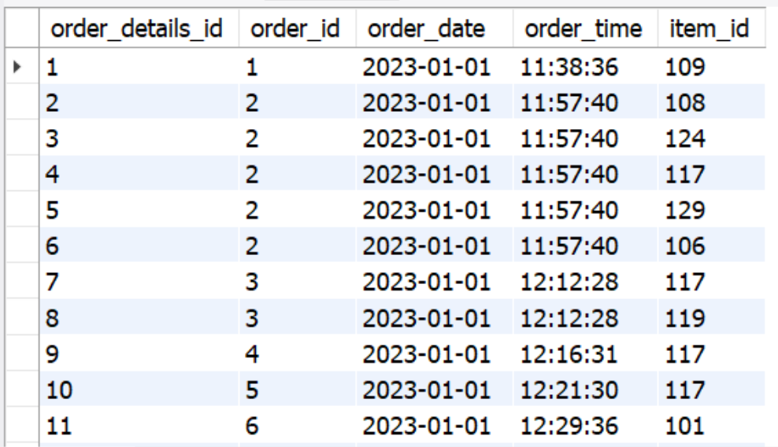

# Restaurant-Order-Analysis
This project explores and analyzes order data of **Taste of the World Cafe** focusing on customer purchases of the restaurant's new menu items between January and March 2023.   
The goal of this project is to identify which menu items are doing well and which are not, as well as to analyze customer preferences and make recommendations for improving restaurant operations.  

🚀 **Project Overview**  
This project is part of a guided course from [Maven Analytics](https://www.mavenanalytics.io/). The dataset and project structure were provided, but all **data preparation, analysis, and visualization were completed by me**.

## 📚 Project Steps
### Overview of the Dataset

The original dataset consists of **two tables**:
1. **`menu_items`**: Contains information about the menu, including item names, categories, and prices.
2. **`order_details`**: Contains data on customer orders, linking order IDs to menu items, and recording order dates and times.
Together, these tables allow for a comprehensive analysis of menu performance and customer behavior.

### Step 1: Explore the `menu_items` table

To get an idea of what's on the new menu, I explored the `menu_items` table, which includes details like item names, categories, and prices.  
   ```sql
   SELECT * FROM menu_items;
   ```


- **What I learned:** This step helped me understand the range of items on the menu and provided an overview of the restaurant's offerings.

### Step 2: Understanding the number of items  
   I used a `COUNT` function to determine how many items are on the menu.

   ```sql
   SELECT COUNT(*) FROM menu_items;
   ```

   
- Data exploration and preparation for analysis.
- Joining multiple tables to analyze customer order behavior.
- Analyzing trends and customer preferences through SQL queries.
- Generating reports and insights to help make business decisions.

## 💻  Technology Used:
SQL (MySQL Workbench)

## 🚀 How to Use This Project

To explore the analysis, open the following link:
👉 [Explore Analysis and Dashboards](https://1drv.ms/x/s!AotNo-BOT0J6oXo2PvooiMvfgeYd?e=iVqcbU) (Recommended: Open link in a new tab)  
👉 Prefer a quick look? Scroll down to preview key data insights and dashboards for each shop—no need to open the full project!

## 📸 Preview of Tables and Data Visualizations
**Menu Items Table Overview** (_A snapshot of the menu items, including item names, categories, and prices._)
  
    
   

**Order Details Table Overview** A snapshot of customer orders showing order IDs, items ordered, and timestamps.

 


An overview of insights into customer order behavior and trends.📸 Preview of Dashboards and Data Visualizations

1. **Data Exploration Overview**  
   

2. **Astoria Shop Sales Dashboard**  
   

3. **Hell's Kitchen Shop Sales Dashboard**  
   

4. **Lower Manhattan Shop Sales Dashboard**  
   

## 🔥 Key Insights:
- All locations show a strong positive growth trend, suggesting increasing customer demand over time.  
- Weekdays are consistently busy across all locations, especially in the morning hours between 7am and 10am,
indicating a likely demand for breakfast items, coffee, and quick service.
- However, the evening hours after 6 pm in Lower Manhattan and after 7 pm in Hell's Kithcen show very low transactions.   
- Coffee is the primary driver of sales across all locations, with tea and bakery items contributing to a smaller extent.

## 💡 What recomendations can be offered:
- Since the evening hours are not busy, the store may lose money by staying open after 6 pm. It’s worth considering adjusting the store’s operating hours.  
- Offering discounts and promotions to customers in slow hours could encourage more people to visit when the store isn’t already overwhelmed.   
- Promoting items like breakfast sandwiches or pastries alongside coffee during peak hours could increase the average transaction value. 
