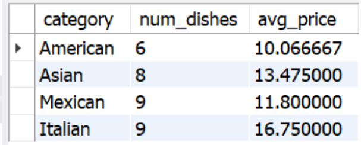
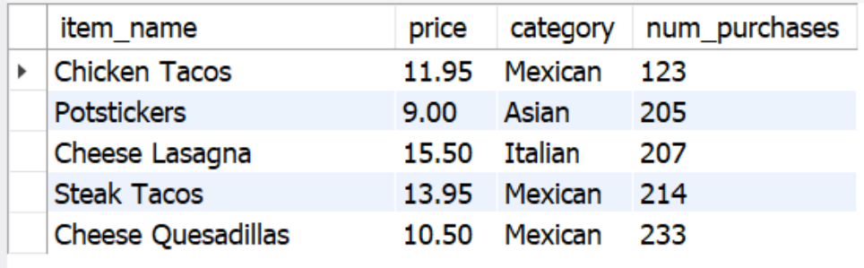
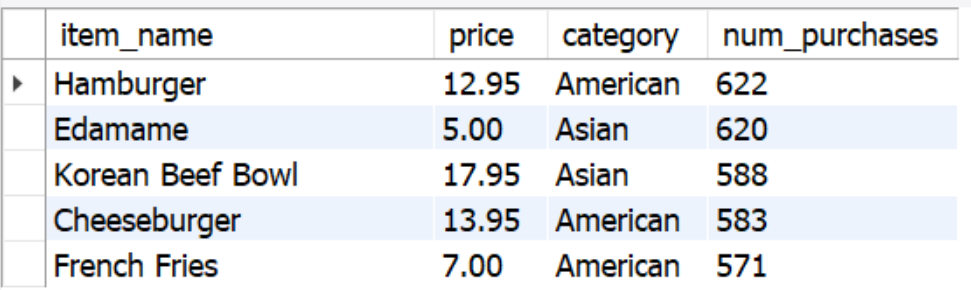

# Restaurant-Order-Analysis
This project explores and analyzes order data of **Taste of the World Cafe** focusing on customer purchases of the restaurant's new menu items between January and March 2023.   
The goal of this project is to identify which menu items are doing well and which are not, as well as to analyze customer preferences and make recommendations for improving restaurant operations.  

🚀 **Project Overview**
- The original dataset consists of **two tables**:
1. **`menu_items`**: Contains information about the menu, including item names, categories, and prices.
2. **`order_details`**: Contains data on customer orders, linking order IDs to menu items, and recording order dates and times.
Together, these tables allow for a comprehensive analysis of menu performance and customer behavior.
- This project is part of a guided course from [Maven Analytics](https://www.mavenanalytics.io/). The dataset and project structure were provided, but all **data preparation, analysis, and visualization were completed by me**.

## 📚 Project Objectives:
- Understand Menu Composition & Pricing: Identify the number of dishes, their price range, and distribution across categories.
- Analyze Customer Order Behavior: Track total orders, order frequency, and item popularity.
- Identify Revenue Drivers: Determine high-value orders and top-spending customers

## 💻  Technology Used:
SQL (MySQL Workbench)

## 🚀 How to Use This Project
To explore the analysis, open SQL_Files Folder and download all .sql files to your computer:
👉 [Open SQL_Files](https://github.com/Obu541/Restaurant-Order-Analysis/tree/main/SQL_Files)   
   (Recommended: Open link in a new tab)  
👉 Prefer a quick look? Scroll down to preview key data insights and dashboards for each shop—no need to open the full project!

## 🍽️ Menu Analysis 
### 1. Explore the `menu_items` table
This includes details like item names, categories, and prices.  
   ```sql
   SELECT * FROM menu_items;
   ```


### 2. Understanding the number of items  
   Number of items on the menu – 32
   ```sql
   SELECT COUNT(*) FROM menu_items;
   ```


###  3. Identify the least and most expensive items
   Least expensive: Edamame(Asian) - $5.00  
   Most expensive: Shrimp Scampi(Italian) - $19.95
```sql
SELECT * FROM menu_items ORDER BY price;
SELECT * FROM menu_items ORDER BY price DESC;
```


### 4. Identify the number of Italian dishes on the menu
   Number of Italian dishes on the menu - 9
```sql
SELECT COUNT(*) FROM menu_items WHERE category = "Italian";
```


### 5. Identify the least and most expensive Italian dishes  
   Least expensive: Spaghetti - $14.50  
   Most expensive: Shrimp Scampi - $19.95
```sql
SELECT * FROM menu_items WHERE category = "Italian" ORDER BY price;
SELECT * FROM menu_items WHERE category = "Italian" ORDER BY price DESC;
```


### 6. Count the number of dishes and the average price in each category
   
   ```sql
SELECT category, COUNT(menu_item_id) AS num_dishes, AVG(price) AS avg_price  
FROM menu_items GROUP BY category;
```


## 🛒 Order Analisys
### 1. Explore the `order_details` table
This includes details such as order IDs, item IDs, order dates, and order times.
```sql
SELECT * FROM order_details;
```


### 2. Finding the date range of the table
The earliest date is 01/01/2023 and the latest date is 03/31/2023  
```sql
SELECT MIN(order_date), MAX(order_date) FROM order_details;
```


### 3. Counting the number of orders in the date range
Number of orders - 5370
```sql
SELECT COUNT(*) FROM
(SELECT order_id, COUNT(item_id) AS num_items 
FROM order_details
GROUP BY order_id
HAVING num_items > 12) AS num_orders;
```


### 4. Counting the total number of items ordered
Total number of items - 12234
```sql
SELECT COUNT(*) FROM order_details;
```


### 5. Finding the orders with the most items
```sql
SELECT order_id, COUNT(item_id) AS num_items 
FROM order_details
GROUP BY order_id
ORDER BY num_items DESC;
```


### 6. Finding number of orders with more than 12 items
```sql
SELECT COUNT(*) FROM
(SELECT order_id, COUNT(item_id) AS num_items 
FROM order_details
GROUP BY order_id
HAVING num_items > 12) AS num_orders;
```


## 💵Customer Preferences & Spending Trends
### 1. Combining the `menu_items` and `order_details` tables
This step allows to get a comprehensive view of orders along with their respective details, such as item names and prices.
```sql
SELECT * 
FROM order_details od LEFT JOIN menu_items mi
	ON od.item_id = mi.menu_item_id;
```


### 2. Identifying the top 5 least and most Ordered Items, their Categories and Prices
The top 5 least ordered item are mostly Mexican     
The top 5 most ordered items are mostly American and Asian
```sql
SELECT item_name, COUNT(order_details_id) AS num_purchases
FROM order_details od LEFT JOIN menu_items mi
ON od.item_id = mi.menu_item_id
GROUP BY item_name
Order by num_purchases
Limit 5;
```


```sql
SELECT item_name, COUNT(order_details_id) AS num_purchases
FROM order_details od LEFT JOIN menu_items mi
ON od.item_id = mi.menu_item_id
GROUP BY item_name
Order by num_purchases DESC
Limit 5;
``` 


### 3. Identifying the Top 5 the most expensive Orders
The top 5 of the most expensive orders run between $185.10 AND $192.15 
```sql
SELECT order_id, SUM(price) AS total_spend 
FROM order_details od LEFT JOIN menu_items mi
	ON od.item_id = mi.menu_item_id
GROUP BY order_id
ORDER BY total_spend DESC
LIMIT 5;
```


### 4. Viewing the details of the highest order
The Italian food ordered the most in the highest order 440, the most popular are 
two dishes: Spaghetti&Meatballs and Fettuccine Alredo.   
```sql
SELECT category, item_name, price, COUNT(item_id) AS num_items 
FROM order_details od LEFT JOIN menu_items mi
	ON od.item_id = mi.menu_item_id
WHERE order_id = 440
GROUP BY category, item_name, price
ORDER BY num_items DESC;
```


### 5. Viewing the details of the Top 5 Highest Spent Orders
As the top 5 of the highest orders was identifyed earlier, in this step it is important look on them more in detail.
```sql
SELECT order_id, category, COUNT(item_id) AS num_items 
FROM order_details od LEFT JOIN menu_items mi
	ON od.item_id = mi.menu_item_id
WHERE order_id IN (440, 2075, 1957, 330, 2675)
GROUP BY order_id, category;
```


## 🔥 Key Insights:

### 1. Menu Composition & Pricing Analysis:
- The menu consists of 32 dishes, with a mix of categories including American, Asian, Italian, and Mexican.
- The most expensive item is **Shrimp Scampi** (Italian, $19.95), and the least expensive is **Edamame** (Asian, $5.00)

### 2. Customer Preferences & Ordering Trends:
- The **Top 5 most ordered items** are mainly **American** and **Asian** with **Hamburger** (American) leading
- The **Top 5 least ordered items** are almost entirely **Mexican**, with **Chicken Tacos** (Mexican) being the least popular dish. 
- The analysis showed that **Italian Food** was consistently prefered in the highest-value orders.

### 3. Revenue & Spending Insights:
- The **Top 5 spending orders** range between **$185.10 to $192.15**, suggesting opportunities for targeting high-spending customers with premium options.
- A detailed analysis of the most expensive orders shows a preference for **Italian dishes**, such as **Spaghetti & Meatballs** and **Fettuccine Alfredo**.
- Even though Italian dishes bring in more revenue due to their higher price, the most popular items are American and Asian dishes, like Hamburger, Edamame, and Korean Beef Bowl.
- The Korean Beef Bowl ($17.95) was ordered 588 times, while Shrimp Scampi ($19.95) was ordered 239 times.
  
## 💡 Recomendations:
### 1. Menu Optimization:  
**Create Combo Deals:** Create bundled meals for popular items to boost sales and make it easier for customers to order more.  
**Reevaluate Pricing Strategy:** Balance high-end and budget-friendly items to appeal to a variety of customers and maximize sales.

### 2. Customer Engagement & Upselling:  
**Target High-Spenders:** Reward loyal, big-spending customers with exclusive deals and incentives to keep them coming back.  
**Promote Bestsellers:** Highlight popular items like Hamburgers, Edamame and Korean Beef Bowl, and suggest extras to increase the average order value.

### 3. Customer Feedback:  
**Get Feedback:** Ask customers what they think about new menu items and make quick changes based on their input to keep them happy.
